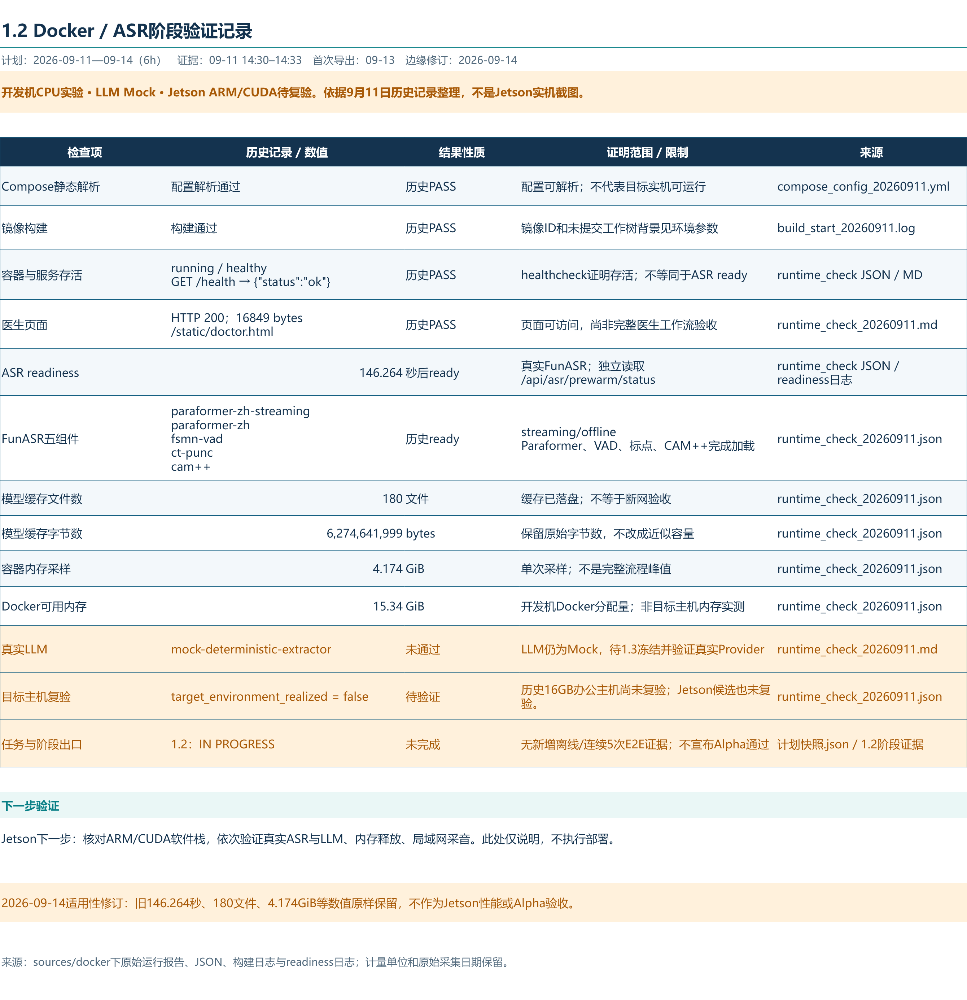

# 1.2 Docker / 本地运行环境整合阶段成果

[返回任务索引](../PLAN_SNAPSHOT.md)

计划日期：2026-09-11后3h、2026-09-14前3h，计划投入6h。负责人：李国毅。现行任务状态：**IN PROGRESS**。
证据时段：2026-09-11 14:30–14:33，运行记录采集14:33:17（Asia/Shanghai）。首次导出日期：2026-09-13；本修订导出日期：2026-09-14。计划工时不是实际耗时。

**开发机CPU实验 · LLM Mock · Jetson ARM/CUDA待复验**

2026-09-14适用性补充：以下9月11日数值完整保留，仅证明开发机历史实验。候选Jetson的8GB共享内存、ARM软件包、CUDA运行栈、镜像和真实LLM均未验证，不能继承原16GB办公主机容量假设。

## 文件与展示

- [环境检查工作簿（边缘端适用性说明版）](1.2_环境检查_边缘端适用性说明版.xlsx)
- [环境验证展示图](1.2_环境验证展示_边缘端适用性说明版.png)

图片依据历史运行记录整理，不是实时界面截图，也不是本次新增运行结果。

## 已完成部分

| 检查 | 历史结果 | 证明范围 |
| --- | --- | --- |
| Docker / Compose | 29.6.1 / 5.1.4 | 开发机运行工具版本 |
| Compose解析与镜像构建 | PASS | 配置可解析、镜像可构建 |
| 容器 | running / healthy | 服务进程和healthcheck存活 |
| GET /health | {"status":"ok"} | 只证明服务存活 |
| GET /static/doctor.html | HTTP 200，16849 bytes | 医生页面可访问 |
| FunASR readiness | 146.264秒后ready | 真实ASR预加载就绪 |
| FunASR五组件 | paraformer-zh-streaming、paraformer-zh、fsmn-vad、ct-punc、cam++ | 组件完成加载 |
| 模型缓存 | 180文件，6,274,641,999 bytes | 历史缓存落盘记录 |
| 采样内存 | 4.174GiB / Docker可用15.34GiB | 单次样本，不是全流程峰值 |

镜像为`medical-record-agent:alpha12-20260911`，宿主机端口2600映射容器8000。镜像ID、容器及完整代码SHA见工作簿“环境参数”和原始JSON。

构建基于分支`codex/issue-41-role-policy-calibration`，代码SHA为`896c8f89dc4d3bc3d94381b85860f723a37be9ea`，构建前工作树不干净，有41个状态条目。因此该SHA不是完整构建内容的唯一标识；应结合镜像ID和配置/构建记录追踪，不把这次构建描述成干净提交复现。

## 尚未证明的要求

1. 运行发生在当前开发机代理环境。`MRA-ALPHA-ENV-01`为目标编号，实际16GB集显主机尚未复验。
2. LLM仍为`mock-deterministic-extractor`，尚未通过真实模型门槛。
3. `/health`不等于模型ready；ASR须读取`/api/asr/prewarm/status`。本次ASR加载就绪不能代替真实音频完整转写与医生闭环验收。
4. 单次4.174GiB采样不证明长时峰值或目标机容量。缓存落盘不直接证明离线运行成功。
5. 本材料不证明断网验收、连续5次真实音频E2E或M4通过，任务保持IN PROGRESS。

## 下一步验证

先在1.1实际目标环境按版本化文档复现Compose启动，记录环境差异、镜像、工作树背景、端口与缓存。分别保存health与实际选定Provider readiness。1.3需冻结真实ASR/LLM版本和运行模式；本次展示整理不执行这些业务任务，也不更新任何验收状态。

## 历史来源与本仓库保存范围

本目录同步的是展示文件与说明，不包含原始设备标识、音频、数据库和全部运行日志。历史记录的数值摘要及来源文件SHA256见[历史事实与适用性](../HISTORICAL_CONTEXT.md)。工作簿内的sources路径指原本地Alpha展示包，原始证据仍保存在本地。

## 边缘端迁移前提

本次只补展示适用性。后续须另验证Jetson软件栈、真实ASR与LLM、8GB内存释放及局域网HTTPS采音；当前业务Dockerfile安装CPU版PyTorch，不能直接当作Jetson CUDA镜像。候选详见[1.1边缘端说明](../20260911_1.1_目标硬件与BOM/1.1_边缘端修订说明.md)。旧环境展示图保留在本地作业包归档。
