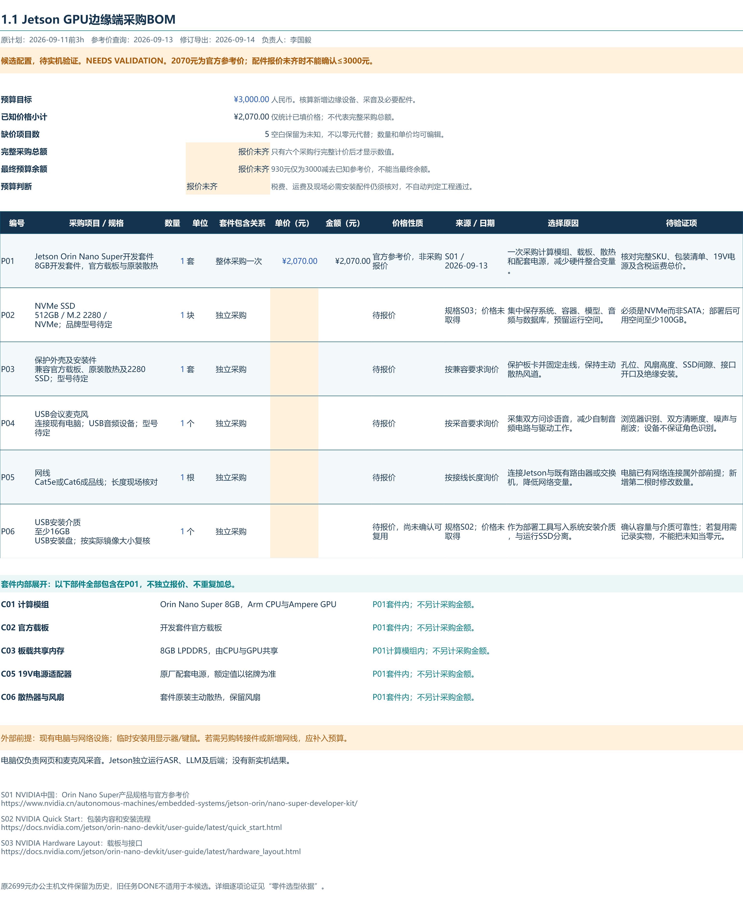
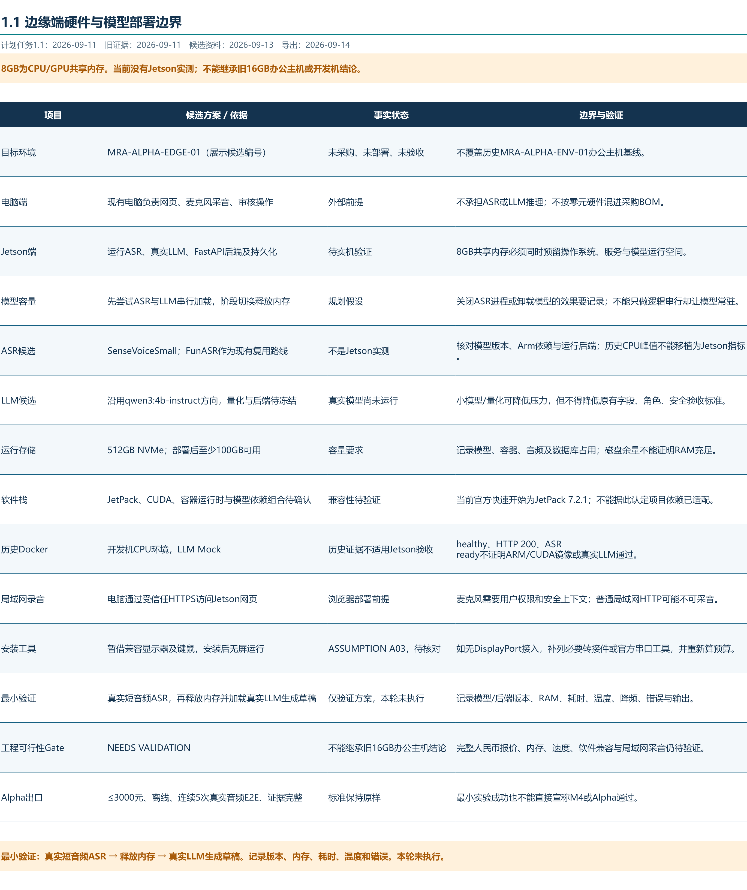

# 1.1 Jetson边缘端BOM与零件选型说明

[返回任务索引](../PLAN_SNAPSHOT.md) · [历史办公主机基线](../HISTORICAL_CONTEXT.md)

**候选配置，待实机验证。工程可行性Gate：NEEDS VALIDATION。**

原任务计划：2026-09-11前3h，计划投入3h，负责人李国毅。旧证据采集于2026-09-11；本次规格和参考价查询日期为2026-09-13，最终文档导出日期为2026-09-14。计划工时不是本次实际耗时。原任务DONE仅对应旧办公主机基线，不代表Jetson候选已验收。

## 文件入口

- [边缘端BOM工作簿](1.1_边缘端BOM与选型依据.xlsx)：三个工作表，金额可编辑并自动计算。
- [采购与预算展示图](1.1_边缘端BOM展示.png)。
- [硬件与模型部署边界展示图](1.1_边缘端硬件与模型容量.png)。
- [来源记录](../sources/edge_revision_20260913/来源记录.md)与[新增文件哈希](../SHA256SUMS.txt)。

## 边缘设备承担什么工作

选择NVIDIA Jetson Orin Nano Super开发套件，装入兼容的通风外壳，作为GPU边缘计算盒。候选编号为`MRA-ALPHA-EDGE-01`，仅用于本次展示，未替换正式环境编号。

现有电脑连接USB会议麦克风，负责浏览器采音、显示和医生操作；局域网将音频交给Jetson。Jetson独立完成ASR、LLM与后端处理，并在本地SSD保存音频、数据库和输出。现有电脑不承担模型推理。浏览器麦克风授权和受信任HTTPS需要验证，普通局域网HTTP不应被视为可直接采音的保证。[MDN采音条件](https://developer.mozilla.org/en-US/docs/Web/API/MediaDevices/getUserMedia)

## 采购BOM与预算

预算目标仍为**新增设备与必要配件合计不超过3000元**。现有电脑、已有网络设施和临时安装用显示器/键鼠作为外部前提单列。麦克风、网线和安装U盘尚未确认有可复用实物，因此按需新增采购行保留，不能按零元处理。

| 编号 | 采购项目 | 规格 | 数量 / 单位 | 人民币单价 | 价格性质 | 选型理由与待核对 |
| --- | --- | --- | --- | ---: | --- | --- |
| P01 | Jetson Orin Nano Super开发套件 | 8GB开发套件，官方载板与原装散热 | 1 / 套 | 2070 | 官方参考价，非采购报价 | 一次采购计算模组、载板、散热和配套电源，减少硬件整合变量。 核对完整SKU、包装清单、19V电源及含税运费总价。 |
| P02 | NVMe SSD | 512GB / M.2 2280 / NVMe；品牌型号待定 | 1 / 块 | 待报价 | 待报价 | 集中保存系统、容器、模型、音频与数据库，预留运行空间。 必须是NVMe而非SATA；部署后可用空间至少100GB。 |
| P03 | 保护外壳及安装件 | 兼容官方载板、原装散热及2280 SSD；型号待定 | 1 / 套 | 待报价 | 待报价 | 保护板卡并固定走线，保持主动散热风道。 孔位、风扇高度、SSD间隙、接口开口及绝缘安装。 |
| P04 | USB会议麦克风 | 连接现有电脑；USB音频设备；型号待定 | 1 / 个 | 待报价 | 待报价 | 采集双方问诊语音，减少自制音频电路与驱动工作。 浏览器识别、双方清晰度、噪声与削波；设备不保证角色识别。 |
| P05 | 网线 | Cat5e或Cat6成品线；长度现场核对 | 1 / 根 | 待报价 | 待报价 | 连接Jetson与既有路由器或交换机，降低网络变量。 电脑已有网络连接属外部前提；新增第二根时修改数量。 |
| P06 | USB安装介质 | 至少16GB USB安装盘；按实际镜像大小复核 | 1 / 个 | 待报价 | 待报价，尚未确认可复用 | 作为部署工具写入系统安装介质，与运行SSD分离。 确认容量与介质可靠性；若复用需记录实物，不能把未知当零元。 |

**已知价格小计2070元；5项缺价，采购总额与最终预算余额尚不可确定。** 2070元是查询日NVIDIA中国页面列示的参考价，非经销商含税运费报价。3000−2070=930元只是尚可容纳缺价项目的差额，不能作为“完整方案预算余额”或预算达标结论。[官方参考价格](https://www.nvidia.cn/autonomous-machines/embedded-systems/jetson-orin/nano-super-developer-kit/)

工作簿只对六个采购行计价。P01整套计一次，CPU、GPU、内存、载板、电源和散热不另加金额。空价的行金额保持空白；任何缺价都使总额/余额显示“报价未齐”。数量或单价变化会重新计算。所有价格齐备且总额不超预算时，只能称“按所填价格未超预算”，仍需核对实际SKU、税费、运费和必要工具。

## 每一项零件为什么这样选择

### C01 计算模组

- **方案与计价**：Orin Nano Super 8GB，Arm CPU与Ampere GPU；P01套件内。
- **承担功能**：在边缘盒独立承担ASR、LLM与后端。
- **选择原因**：选择Jetson软硬件生态，适合验证GPU本地推理。
- **替代方案与取舍**：CPU小板可减少CUDA依赖，但需重做性能对照；更大内存Jetson成本更高。
- **兼容要求**：核对准确模组与固件；CPU/GPU不是独立采购散件。
- **如何验证**：真实音频ASR和真实LLM分别运行，记录正确性、耗时和负载。
- **依据**：S01，见来源记录；工程取舍为本次设计判断。

### C02 官方载板

- **方案与计价**：开发套件官方载板；P01套件内。
- **承担功能**：连接供电、USB、以太网与NVMe。
- **选择原因**：复用经过配套设计的接口，避免本轮自制载板。
- **替代方案与取舍**：第三方载板可缩小体积，但引入引脚、固件和外壳差异。
- **兼容要求**：M.2 2280 Key-M、网口、USB和供电版本均核对。
- **如何验证**：识别SSD与网口，记录板卡版本并检查每个实际使用接口。
- **依据**：S03，见来源记录；工程取舍为本次设计判断。

### C03 板载共享内存

- **方案与计价**：8GB LPDDR5，由CPU与GPU共享；P01计算模组内。
- **承担功能**：容纳系统、模型权重、激活、KV缓存和运行服务。
- **选择原因**：采用套件既定容量，先做最小内存验证；不是另加8GB显存。
- **替代方案与取舍**：更大内存平台留量更大但增加预算；SSD交换区不等同物理内存。
- **兼容要求**：不可作为普通DIMM另购；模型文件大小不等于运行峰值。
- **如何验证**：记录系统总内存及可用量、进程RSS、阶段切换、OOM和交换活动。
- **依据**：S01 / S06；工程容量分析，见来源记录；工程取舍为本次设计判断。

### C04 NVMe SSD

- **方案与计价**：512GB，M.2 2280，NVMe；P02独立采购。
- **承担功能**：保存系统、镜像、模型、问诊音频、SQLite与导出文件。
- **选择原因**：以一块运行盘集中管理持久化，目标部署后至少100GB余量。
- **替代方案与取舍**：microSD成本可能更低但需比较写入可靠性；更大SSD增加成本。
- **兼容要求**：不选M.2 SATA；确认固定螺丝、厚度、温度、NVMe识别。
- **如何验证**：核对真实容量，安装后检查可用空间与写入/重启持久化。
- **依据**：S03；项目容量要求，见来源记录；工程取舍为本次设计判断。

### C05 19V电源适配器

- **方案与计价**：原厂配套电源，额定值以铭牌为准；P01套件内。
- **承担功能**：为计算模组、载板与外设稳定供电。
- **选择原因**：使用与官方接口匹配的套件电源，减少供电不稳定因素。
- **替代方案与取舍**：第三方适配器需额外核对极性、插头及额定能力，无缺件时不另购。
- **兼容要求**：核对19V及载板电源插口；普通USB手机充电器不适用。
- **如何验证**：记录铭牌，连续推理期间检查掉电、重启和接头发热。
- **依据**：S02 / S03，见来源记录；工程取舍为本次设计判断。

### C06 散热器与风扇

- **方案与计价**：套件原装主动散热，保留风扇；P01套件内。
- **承担功能**：排出持续CPU/GPU推理产生的热量。
- **选择原因**：先使用配套方案，避免无依据改为被动散热。
- **替代方案与取舍**：被动外壳更安静但散热能力需重验；大型风扇改变外壳适配。
- **兼容要求**：外壳不能遮挡进出风；核对风扇接口、固定件及线缆。
- **如何验证**：记录环境温度、芯片温度、频率、功耗模式与是否降频。
- **依据**：套件组成按到货清单核对；工程热设计要求，见来源记录；工程取舍为本次设计判断。

### C07 保护外壳及安装件

- **方案与计价**：通风外壳，型号待定；P03独立采购。
- **承担功能**：保护板卡、固定SSD和线缆，便于展示搬运。
- **选择原因**：降低裸板接触和拉扯风险，同时保留原装散热空间。
- **替代方案与取舍**：裸板支架便宜但保护较少；定制外壳增加制造和适配工作。
- **兼容要求**：必须明确兼容官方载板，不只写兼容Orin Nano模组。
- **如何验证**：逐一试装孔位、接口、SSD与风道，检查绝缘和稳固性。
- **依据**：工程装配要求，见来源记录；工程取舍为本次设计判断。

### C08 USB会议麦克风

- **方案与计价**：型号待定，接现有电脑USB口；P04独立采购。
- **承担功能**：在浏览器端采集医生和患者的真实声音。
- **选择原因**：选择通用USB音频设备，避免增加模拟前端或单片机采音链路。
- **替代方案与取舍**：电脑内置麦克风可作对照，但不能假定满足双人拾音质量。
- **兼容要求**：核对电脑系统、Chrome/Edge、权限及安全上下文；线缆不重复购买。
- **如何验证**：固定距离录制双方对话，检查识别、噪声、削波和ASR输入可读性。
- **依据**：S04；项目采音要求，见来源记录；工程取舍为本次设计判断。

### C09 网线与必要连接件

- **方案与计价**：1根Cat5e/Cat6，按现场补足；P05独立采购。
- **承担功能**：将Jetson接入既有局域网。
- **选择原因**：有线连接便于复现传输与中断问题。
- **替代方案与取舍**：Wi-Fi减少布线，但增加信号和接入变量；本轮不另购无线模块。
- **兼容要求**：电脑已有联网条件需核实；套件或已有线材不能重复计价。
- **如何验证**：电脑访问Jetson，测试上传、结果返回、HTTPS录音及断网不依赖云推理。
- **依据**：S03 / S04，见来源记录；工程取舍为本次设计判断。

### C10 系统安装介质

- **方案与计价**：USB安装盘至少16GB；P06部署工具。
- **承担功能**：承载系统安装程序，安装完成后运行数据留在SSD。
- **选择原因**：与运行盘分工明确，便于重新部署。
- **替代方案与取舍**：复用现有合格U盘可降低新增费用，需先核实并记录；不默认再买microSD。
- **兼容要求**：核对官方安装版本、固件前提和实际镜像尺寸；显示器或串口方案另核对。
- **如何验证**：检查介质可写可读及安装文档匹配；本轮不执行写盘或刷机。
- **依据**：S02，见来源记录；工程取舍为本次设计判断。

## 模型与部署边界

| 项目 | 候选方案 / 依据 | 事实状态 | 边界与验证 |
| --- | --- | --- | --- |
| 目标环境 | MRA-ALPHA-EDGE-01（展示候选编号） | 未采购、未部署、未验收 | 不覆盖历史MRA-ALPHA-ENV-01办公主机基线。 |
| 电脑端 | 现有电脑负责网页、麦克风采音、审核操作 | 外部前提 | 不承担ASR或LLM推理；不按零元硬件混进采购BOM。 |
| Jetson端 | 运行ASR、真实LLM、FastAPI后端及持久化 | 待实机验证 | 8GB共享内存必须同时预留操作系统、服务与模型运行空间。 |
| 模型容量 | 先尝试ASR与LLM串行加载，阶段切换释放内存 | 规划假设 | 关闭ASR进程或卸载模型的效果要记录；不能只做逻辑串行却让模型常驻。 |
| ASR候选 | SenseVoiceSmall；FunASR作为现有复用路线 | 不是Jetson实测 | 核对模型版本、Arm依赖与运行后端；历史CPU峰值不能移植为Jetson指标。 |
| LLM候选 | 沿用qwen3:4b-instruct方向，量化与后端待冻结 | 真实模型尚未运行 | 小模型/量化可降低压力，但不得降低原有字段、角色、安全验收标准。 |
| 运行存储 | 512GB NVMe；部署后至少100GB可用 | 容量要求 | 记录模型、容器、音频及数据库占用；磁盘余量不能证明RAM充足。 |
| 软件栈 | JetPack、CUDA、容器运行时与模型依赖组合待确认 | 兼容性待验证 | 当前官方快速开始为JetPack 7.2.1；不能据此认定项目依赖已适配。 |
| 历史Docker | 开发机CPU环境，LLM Mock | 历史证据不适用Jetson验收 | healthy、HTTP 200、ASR ready不证明ARM/CUDA镜像或真实LLM通过。 |
| 局域网录音 | 电脑通过受信任HTTPS访问Jetson网页 | 浏览器部署前提 | 麦克风需要用户权限和安全上下文；普通局域网HTTP可能不可采音。 |
| 安装工具 | 暂借兼容显示器及键鼠，安装后无屏运行 | ASSUMPTION A03，待核对 | 如无DisplayPort接入，补列必要转接件或官方串口工具，并重新算预算。 |
| 最小验证 | 真实短音频ASR，再释放内存并加载真实LLM生成草稿 | 仅验证方案，本轮未执行 | 记录模型/后端版本、RAM、耗时、温度、降频、错误与输出。 |
| 工程可行性Gate | NEEDS VALIDATION | 不能继承旧16GB办公主机结论 | 完整人民币报价、内存、速度、软件兼容与局域网采音仍待验证。 |
| Alpha出口 | ≤3000元、离线、连续5次真实音频E2E、证据完整 | 标准保持原样 | 最小实验成功也不能直接宣称M4或Alpha通过。 |

8GB是CPU/GPU共用的物理内存池。模型权重之外，还要预留系统、CUDA上下文、ASR中间张量、LLM KV缓存和后端服务；不能简单把模型文件大小相加就宣布够用。以串行加载为初始实验路线，测量释放效果。更小量化模型是可能的验证备选，不构成降低Alpha验收标准的许可。

原开发机CPU、31.43GB内存与独立GPU，旧16GB办公主机假设，以及历史ASR内存摘要均不代表Jetson实测。旧Docker使用CPU版PyTorch，LLM仍为Mock；详见[1.2适用性说明](../20260911-20260914_1.2_Docker环境整合/1.2_阶段成果说明.md)。本次未运行任何模型或修改容器。

## 最小验证方案（未执行）

1. 核对实物SKU、供电与散热，记录JetPack、内核、CUDA、容器运行时、模型后端和依赖版本。选择兼容组合，不因官方新版本存在就假设所有模型依赖已适配。
2. 记录空载基线，在Jetson用同一段经授权、脱敏的真实短音频运行真实ASR，记录模型版本/哈希、采样参数、输出、加载与转写耗时、内存与温度。仅加载ready不能代替转写成功。
3. 结束或卸载ASR，记录释放前后系统可用内存、进程RSS和缓存。随后在Jetson加载真实LLM生成草稿，保留输入输出和错误。分别记录冷启动与稳态耗时、峰值内存、功耗模式、温度、频率与降频情况。
4. 电脑只采音和访问网页，确认所有模型推理都在Jetson；验证浏览器HTTPS、麦克风授权、上传与结果返回。部署资源预置后，在不接外网条件下复验核心流程。
5. 最小实验先判断能否真实执行且无OOM/进程被杀、阶段切换能否释放足够内存、输出能否进入原验收流程。性能数值如实记录，不预设已达标；超时或质量问题按原任务标准处理。后续仍需连续5次真实音频E2E、医生审核与导出保护、完整证据及预算核对，方可评估M4。

## DESIGN REVIEW

本次评审在展示材料生成前完成。文档修订可继续，硬件/软件实施不在本次范围。

| 步骤 | 评审结论 |
| --- | --- |
| 1 Goal | 将办公整机展示纠正为独立推理的Jetson边缘盒候选，清楚解释采购与零件选择。 |
| 2 Deliverables | 新BOM、逐项依据、两张PNG、部署边界和最小验证方案；保留历史文件。 |
| 3 Input / Output | 输入为电脑采集音频与医生操作；输出为Jetson生成的转写、草稿及受控导出。 |
| 4 Constraints | ≤3000元新增硬件边界；8GB共享内存；单人项目；既有后端；离线、权限、数据与浏览器兼容要求。 |
| 5 最大未知 | 内存与速度是否满足真实模型，ARM/CUDA依赖能否组成可运行镜像。 |
| 6 PBS | 计算套件、持久化存储、保护与连接、采音外设、验证证据包。 |
| 7 Architecture | 浏览器/采音在电脑，模型与后端/数据库在Jetson，通过局域网交互。 |
| 8 Module Boundaries | 浏览器拥有临时采音与UI；后端管理任务及数据；ASR输出文本；LLM输出草稿；审核控制导出。 |
| 9 Interfaces | 音频上传→任务/转写结果→草稿；接口需区分权限拒绝、网络中断、ASR失败、LLM失败和OOM，依赖现有API契约。 |
| 10 WBS | 仅为既有1.1补候选展示，关联1.2环境、1.3 Provider、2.1采音和2.2 ASR；不新建正式任务或改工时。 |
| 11 Dependencies | 实物/报价核对先于基线验收；软件兼容先于真实ASR，ASR与内存释放验证先于真实LLM和E2E。 |
| 12 Critical Path | 本次仅识别实物→兼容栈→真实ASR→真实LLM→离线/E2E的验证阻塞链；不另算或更改正式甘特关键路径。 |
| 13 Risks | 技术/集成：ARM依赖；性能：8GB与热；数据：持久化；安全：HTTPS和受控导出；进度/人员：单人实机验证；范围：禁止顺带新增医学功能。 |
| 14 Minimal Validation | 采用上节真实短音频串行ASR→LLM实验，本轮仅设计。 |
| 15 Milestones / Acceptance | M1–M4日期与标准保持原样；候选不能继承原任务DONE或旧主机验收。 |

### 固定五问

1. **为什么这样拆？** 套件是一项采购单位，零件是功能解释单位；两者分开避免重复计价，端云边界则落实到电脑采音与Jetson推理。
2. **还有什么替代方案？** CPU小板、更多内存的Jetson、不同存储与麦克风均可比较，但会改变性能、预算或兼容工作；本轮遵循已选Jetson路线。
3. **最可能失败在哪里？** ASR/LLM与系统抢占共享内存，以及现有CPU镜像无法直接获得Jetson GPU加速。
4. **怎么以最小成本验证？** 先借用或使用可获得的同型号套件，跑一段真实音频的串行加载实验，保存内存、时间、温度和输出，不先做完整重构。
5. **怎样证明完成？** 展示修订用文件、公式、链接与哈希检查证明；工程可行性必须另有目标实机结果和完整报价；Alpha完成仍按原四项出口条件。

### Assumptions与Gate

- **ASSUMPTION A01**：现有电脑和局域网可复用，电脑已有网络连接，新增网线暂按1根。现场不满足时补足数量并重新核算。
- **ASSUMPTION A02**：512GB NVMe、兼容外壳和USB会议麦克风可获得，但准确SKU与价格未验证。
- **ASSUMPTION A03**：安装时可临时复用DisplayPort显示器及键鼠。若不满足，必要转接或串口配件需补入预算；不伪造已有实物。
- **ASSUMPTION A04**：ASR与LLM串行加载可能减少峰值，但8GB是否足够、是否降频及速度如何均待实机验证。

**DESIGN REVIEW GATE：NEEDS VALIDATION。** 本次完成的是候选展示修订，未实施刷机、模型部署、业务开发或正式项目状态更新。
