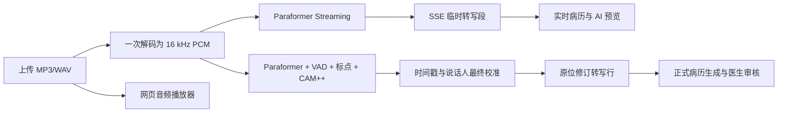

# v0.8.3-v0.8.5 上传音频流式转写与多说话人联动说明

## 本轮目标

本轮把“上传完整音频后等待整段结果”的原型，升级为上传文件的持续处理链路。系统仍然不接浏览器麦克风，但上传 MP3/WAV 后可以在模型处理期间持续收到文字、真实进度和结构化预览。

## 三个时间概念

- **播放时间**：播放器当前播放位置和音频总时长，由浏览器 `<audio>` 控件提供。
- **转写进度**：模型已经处理的音频秒数除以音频总时长，只在进入实际识别后显示百分比。
- **处理用时**：程序实际运行的墙钟时间，只用于调试和性能评测，不作为医生端的音频进度。

模型加载期间无法用“处理到第几秒”计算进度，因此显示“模型加载中”，不显示虚假百分比。没有真实时间戳时显示 `--:--`，不再按固定 8 秒伪造段落时间。

## 流式转写策略

- FunASR 路线使用 `paraformer-zh-streaming`，按约 600 ms 的 PCM 帧持续送入模型。
- 音频只调用一次 ffmpeg 解码，不预先生成大量临时切片。
- 临时段通过 `segment` 事件加入列表，同一段后续使用稳定 `segment_id` 和 `segment_update` 原位修订，避免重复文字。
- 转写结束后运行离线全局校准，补齐标点、时间戳和声学说话人标签。
- SenseVoice、Whisper 等非流式模型继续标记为“分段识别”，不伪装成模型原生实时输出。

## 说话人与临床角色

`speaker_id` 和 `role` 是两个不同概念：

- `speaker_id`：CAM++ 根据声纹聚类得到的说话人 A/B/C。
- `role`：医生、患者、其他或待确认，是对整位说话人的临床身份判断。

声纹模型可以判断“两句话是否像同一个人”，但仅凭声音不能可靠判断该人是医生、患者还是家属。系统会结合整位说话人的全部发言做低置信度角色建议，并保留人工校正。用户把“说话人 B”改为患者后，该说话人的全部发言会同步更新。

以下情况继续保留“待确认”：

- 只有“嗯、好、对”等过短发言。
- 重叠说话、噪声或声线相似导致聚类不稳定。
- 能区分说话人，但无法确定其临床身份。
- 单人朗读医患脚本，声学上只有一个真实说话人。

## 播放器与显示节奏

播放器支持播放/暂停、拖动、音量和 `0.75x` 到 `2.0x` 倍速。点击有时间戳的转写行会跳转并播放对应位置，播放时当前转写行高亮。

- **尽快识别**：默认模式，模型识别出的文字立即显示，与播放器是否播放无关。
- **跟随播放**：模型继续在后台识别，但界面只显示播放位置之前的内容。

媒体接口 `GET /api/audio/{audio_id}/media` 支持 HTTP Range，因此浏览器可以拖动和恢复播放。

## 实时结构化预览

稳定句子产生或修订后，前端最多每 2 秒调用一次预览接口。新请求会取消旧请求，避免旧响应覆盖新内容。

- 左侧更新：主诉、现病史、既往史、过敏史、查体、初步诊断、处理建议。
- 右侧更新：候选诊断、治疗方案、诊断证据。
- 每个预览字段保存来源 `segment_id`；点击证据可定位并播放对应音频。
- 预览统一标记“实时预览，需医生确认”，不创建正式任务，也不能直接导出。

## 前端验收

1. 运行 `docker compose up -d --build`。
2. 打开 `http://127.0.0.1:2601/static/doctor.html`。
3. 选择 FunASR 并上传中文 MP3/WAV。
4. 模型加载阶段确认不显示百分比；识别阶段确认进度按音频处理秒数变化。
5. 确认转写行持续出现，点击行可以跳转播放。
6. 切换“尽快识别/跟随播放”，确认显示节奏不同。
7. 校准结束后确认时间戳和说话人标签可以原位更新。
8. 修改一位说话人的角色，确认其全部发言同步更新。
9. 确认左右栏出现“实时预览，需医生确认”，证据按钮可回放来源。
10. 正式生成后再执行保存、医生审核和导出。

截图证据：

- `docs/final_report/images/v0_8_5_streaming_player/01_text_record_generated.png`
- `docs/final_report/images/v0_8_5_streaming_player/02_streaming_player_reconciled.png`

自动化浏览器已验证媒体元数据、倍速切换和跟随播放模式。受自动化浏览器的媒体播放策略限制，`play()` 会要求真实用户手势；播放/暂停仍需在本机浏览器手工点击复验。

## 安全边界

- 当前是课程工程原型，不是临床自动诊断产品。
- 候选诊断、治疗建议和角色判断都必须由医生确认。
- CAM++ 聚类不等于临床角色识别。
- 实时预览不能绕过正式病历生成、安全校验和医生审核。

参考：[FunASR 官方 README](https://github.com/modelscope/FunASR/blob/main/README.md)。
