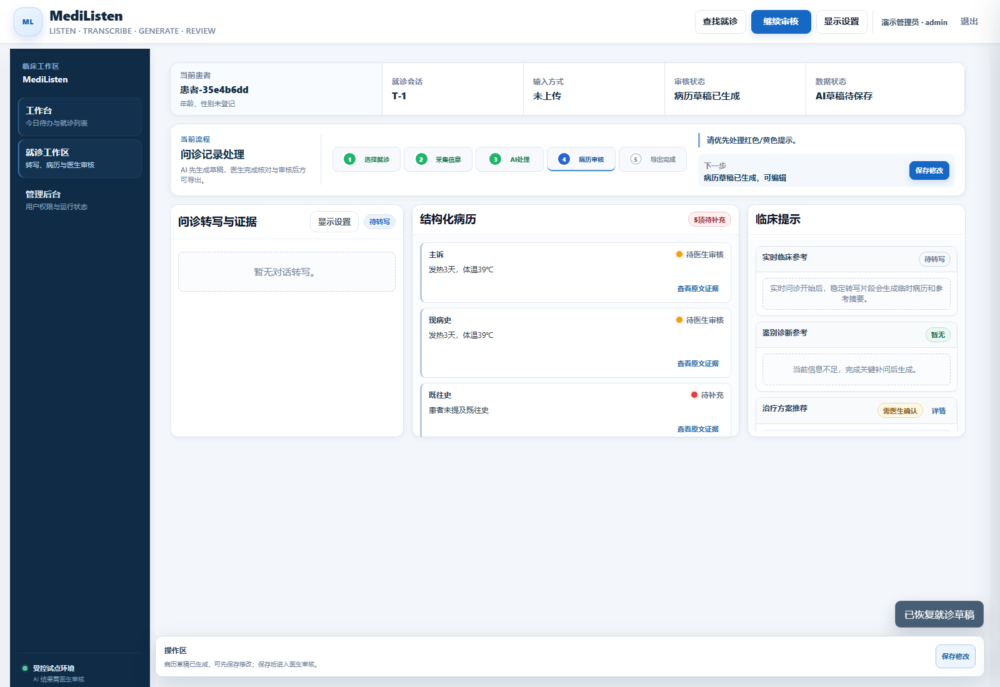
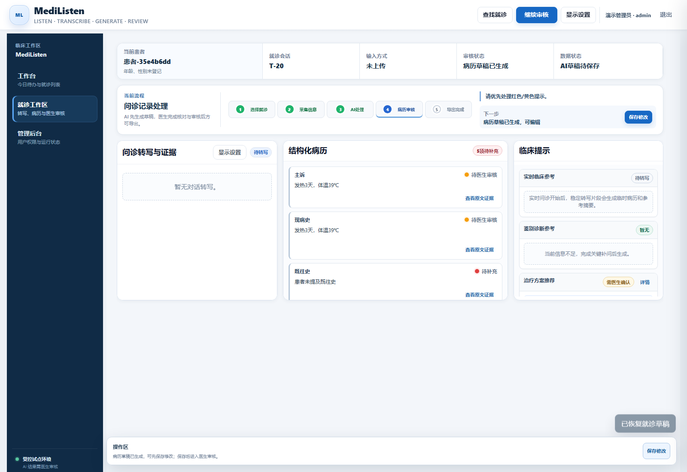

# 2026-09-14 真实本地闭环与安全验证

PR [#99](https://github.com/awa606/medical_record_agent/pull/99) 已按授权合入main，merge commit为 `16d35e1a5ef8574c39a51c88af56bedb4cf9e3e3`；[main verify](https://github.com/awa606/medical_record_agent/actions/runs/34812947848)通过。改进位于 [Draft PR #100](https://github.com/awa606/medical_record_agent/pull/100)，不自动合并。本轮没有修改原工作树的43项既有变更，也没有改写正式15项任务、87h、排期或Gate。

## 实际结果

- Linux [verify](https://github.com/awa606/medical_record_agent/actions/runs/34819570718)：504项测试、8个subtests通过，2项依赖弃用警告。初始干净CI基线455项测试全部保留，未扩大跳过范围。
- 真实 Ollama Qwen3:4b +匿名合成文本：20次生成—审核—导出协议循环成功，Mock回退0。旧Revision、重复批准、未批准导出、修改后旧批准均被拒绝。执行者为隔离测试admin的自动化脚本，不是医生临床签字。
- 发热真实录音在隔离容器回放5次，FunASR转写5/5成功；角色尚未确认，生成5/5返回409，音频完整闭环0/5。保留阻塞，没有伪造人工确认。五次使用同一份录音，不是五段独立样本。
- 20例合成身份API、导出、真实浏览器与页面状态未见标注姓名/证件号/联系方式。模型请求构造另有20例拦截测试；本次保存的ASR/浏览器运行日志扫描无泄漏，但原20次生成的完整日志未保留，因此不宣称所有运行日志已完整验收。受控身份映射、原始音频和DB留在本地。
- 真实应用和Ollama网络内部连通，外部IP与域名连接失败；服务断开使就绪失败，恢复并真实预热后才重新就绪。

## 内容质量与性能

开发集1–40的预期事实恢复由52/93提升到59/93；固定后只评一次冻结41–60集，恢复29/43（67.44%），Schema20/20，39个非空字段中6个仍有证据冲突。没有用全空输出制造安全达标。冲突字段必须修正；自动事实解析器是代理指标，未完成临床人工幻觉裁定。冻结评测的源码内容SHA与后续操作安全补丁分开记录，不重新调冻结集。

三段现有录音共918.167秒：本地FunASR开发基线宏平均CER 20.86%、医学关键词召回 76.67%、最大RTF 0.126。前两项未达到既定阈值；这些开发录音不是独立冻结验收集。

容器20次生成P95为 **18.603秒**，高于15秒目标；首次冷启动含重试为 **142.792秒**。P95按排序后ceil(0.95×N)位置计算，未删慢样本。开发机进程内冻结评测P95 5.973秒与容器API口径不同，不能用前者替换后者。

## 内存故障与修复

首次真实上传与预热重复加载模型造成OOM；复用预热实例、串行转写后，既有Docker服务与五ASR组件常驻仍超过可用容量。保留两次失败，未停止用户已有服务。本回放配置显式使用 `upload` 四组件预热，`/ready`显示该profile；真实转写复验不再OOM。默认流式profile仍为五组件，其内存和麦克风链路未验收。不能把upload就绪视为streaming或Jetson通过。

模型、运行版本和镜像摘要见 [results.json](results.json)。runtime记录真实音频运行的3af6add版本，improvement记录最终UI修正后的823a440版本，两者不混称为同一次运行。复现命令见 [运行说明](../../../../engineering/local_closed_loop_runbook.md)。原始指标来源及哈希见 [source-hashes.json](source-hashes.json)，对应本地 `.artifacts/local-loop/`；不得上传其中的原始音频、身份映射或数据库。

## 课程T01–T13（独立映射，未覆盖V01–V08）

| ID | 项目 | 原验收标准 | 本轮判定 | 实测与缺口 | Alpha映射 |
|---|---|---|---|---|---|
| T01 | 病历生成完整性 | 20例必需字段存在率100% | FAIL | Schema 20/20，但仅恢复29/43项预期事实；不能用空字段替代临床完整性 | V08 |
| T02 | AI幻觉检测 | 虚构事实0、输入矛盾0；一票否决 | NOT TESTED | 6个字段冲突被标记；无临床逐例裁定，不能宣称零幻觉。恶意引用/否定/跨角色门禁测试通过 | V02,V03,V08 |
| T03 | 医学术语规范 | 固定20样本错误0 | NOT TESTED | 本次没有新增经人工复核的20项医学术语验收结果 | V01,V08 |
| T04 | 编辑与人工确认 | 10种场景可编辑；未确认提交/归档成功0 | PARTIAL | 20次真实模型协议循环：未批准导出、旧版本批准、重复批准、修改后导出均拒绝；不替代完整10场景临床验收 | V03,V04 |
| T05 | 脱敏与合规 | 姓名、ID、联系方式脱敏100%，非授权外发0；一票否决 | PARTIAL | 20例合成身份API/导出/真实页面无标注身份泄漏；另测模型请求构造及运行日志。原20次生成的完整日志未保留，尚无真实临床合规验收 | V05,V08 |
| T06 | 操作留痕 | 生成、修改、审核、导出10种操作可追溯100% | PARTIAL | 20次循环保存步骤、Revision与测试账号批准；完整10类操作审计仍需逐项签核 | V03,V08 |
| T07 | 生成时延 | 最终转写完成至病历就绪P95≤15秒 | FAIL | 容器20次文本生成P95=18.603s；首次冷启动及重试=142.792s；含重试、未排除慢样本 | V08 |
| T08 | 双环境一致性 | 20例结构化字段一致率100% | HARDWARE BLOCKED | Jetson未到货；开发机结果不能替代边缘端 | V01,V05 |
| T09 | ASR质量 | CER≤15%，医学关键词召回≥90%，RTF≤1 | FAIL | 三段开发录音CER=20.86%，关键词召回=76.67%，最大RTF=0.126；不是独立冻结集 | V01 |
| T10 | 角色判断 | 可判定样本准确率≥95%；高置信度跨角色写入0；低置信度阻断 | BLOCKED | 真实音频5/5转写后因角色待复核返回409；没有伪造确认或绕过门禁。准确率仍缺人工真值 | V02 |
| T11 | 知识检索 | Recall@5≥90%，引用完整100%，无来源引用0 | NOT TESTED | 保留既有知识索引，本次不扩大知识包或重新做检索验收；历史报告继续单列 | V08 |
| T12 | 离线E2E | 断网后连续5次录音→生成→审核→导出全PASS，Mock0 | BLOCKED | 内部网络已验证；重复发热录音5次ASR均成功，5次都被角色门禁拦截，因此音频闭环0/5；文本协议20/20不得替代 | V05,V06 |
| T13 | 异常恢复 | 10种恢复10/10，数据丢失与重复病历0 | PARTIAL | 真实容器重建后恢复并查看20份既有草稿；模型服务断开503、恢复后就绪。五组件内存失败保留，完整10类故障场景未完成 | V05,V06,V08 |

一票否决项尚未获得完整PASS，不能宣布课程、Alpha或EVT验收通过。Blocker/Critical清零没有得到完整实测证明。

## 真实页面证据

以下截图来自本次容器，使用合成身份和化名。界面已移除虚构的“女/32岁”，未审核字段显示“待医生审核”；修正后重新打开第1、20例并截图。不是生成的演示效果图。

## 下一步

继续既有1.2运行基线及2.3实施清单：对真实音频的说话人片段建立人工复核真值，沿现有ASR会话复核界面确认角色，再运行完整音频审核导出；同时处理容器P95与流式内存限制。正式状态不因代码或协议测试完成自动变为DONE。

## Obsidian同步核对

本轮通过实时工程API为11项Task追加证据链接。写后再次读取共享快照：15任务、87h、19技术依赖、6资源依赖、4里程碑、11风险、8Verification保全；全部Task非Evidence属性、正式日期、状态、工时、依赖和验收定义保持不变，违规数0。

V01/V02/V05/V06/V08按缺失前提从NOT TESTED标为BLOCKED；V03/V04记录部分协议结果，保留NOT TESTED，V07未改。未新增产品PASS；R02/R03/R10补充OOM、角色与真实音频失败记录。精确保护校验见 [pm-sync-verification.json](pm-sync-verification.json)。报告与本地PM日志均注明自动化核验者为Codex，不代填医生或Owner确认。
