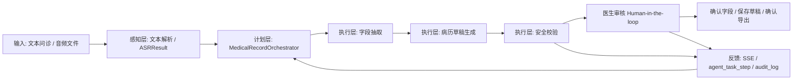
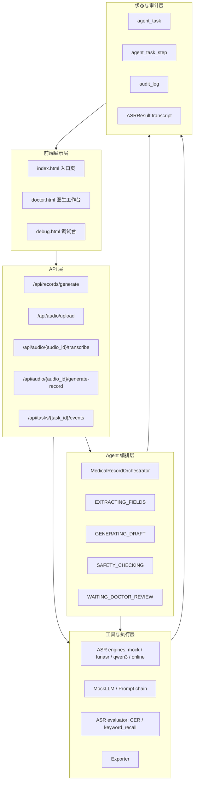
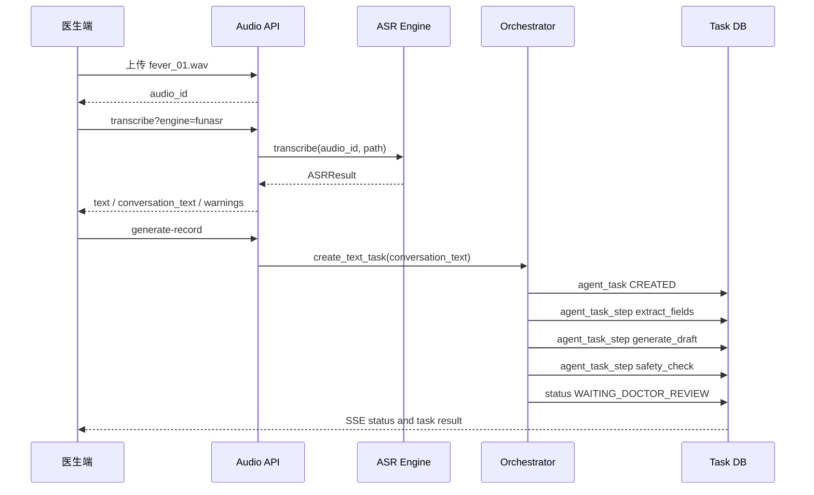
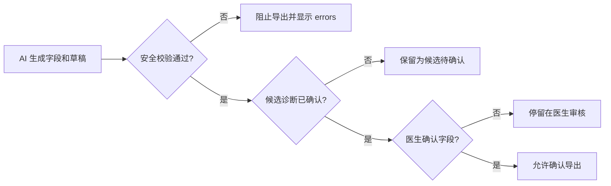

# Agent 架构图

本页用于答辩时快速展示系统不是线性“输入-输出”，而是具有感知、决策、行动、反馈和医生审核边界的 Agent 闭环。

## 总体闭环

## 分层架构

## 音频到病历路径

## 医生审核边界

## 汇报要点

- 架构图中的 `MedicalRecordOrchestrator` 对应智能体计划层。
- `ASRResult`、字段抽取、草稿生成、安全校验对应行动层。
- `agent_task_step` 和 `audit_log` 对应反馈与审计。
- `doctor.html` 中的确认操作对应 Human-in-the-loop。
