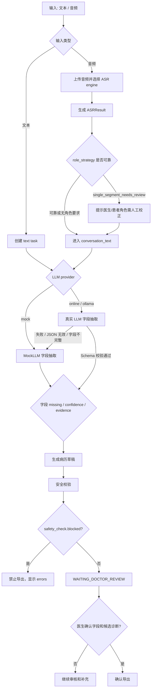

# 决策系统设计

本文档用于支撑课程评分中的“决策系统设计 10 分”。本项目的决策系统不是单点判断，而是由输入路径选择、ASR 质量提示、字段状态、安全校验、任务状态和医生确认共同组成。

## 决策系统总览



## 输入类型决策

| 输入 | API | 决策 |
| --- | --- | --- |
| 文本问诊 | `POST /api/records/generate` | 直接创建 text task，进入 Agent 主流程 |
| 上传音频测试转写 | `POST /api/audio/upload` + `POST /api/audio/{audio_id}/transcribe` | 只生成 ASRResult，不自动生成病历 |
| 上传音频生成病历 | 上传 + 转写 + `POST /api/audio/{audio_id}/generate-record` | 使用 `ASRResult.conversation_text` 创建 text task |

设计理由：

- 文本与音频统一收敛到 `conversation_text`，保证病历 Agent 主流程稳定。
- ASR 对比引擎只改变感知层，不替换 FunASR baseline，不影响后续字段抽取逻辑。

## ASR 角色策略决策

ASRResult 中的 `role_strategy` 用于判断医生/患者角色是否可靠。

| `role_strategy` | 决策 |
| --- | --- |
| `single_segment_needs_review` | 在医生端右栏提示“医生/患者角色需人工校正” |
| 有分段且角色可靠 | 按 segments 展示医生/患者对话 |
| 无角色信息 | 不强行标注医生/患者，保留原始文本 |

设计理由：

- 医疗问诊中医生和患者角色会影响字段归属。
- 如果 ASR 只返回单段长文本，系统不应伪造角色，应把风险显式交给医生复核。

## LLM Provider 决策

字段抽取阶段根据 `LLM_PROVIDER` 选择 provider：

| `LLM_PROVIDER` | 决策 |
| --- | --- |
| `mock` 或未设置 | 使用 MockLLM deterministic extractor，保证演示稳定 |
| `online` | 调用 OpenAI-compatible provider，只做字段抽取 |
| `ollama` | 调用本地 Ollama provider，只做字段抽取 |
| 配置缺失、接口失败、超时、JSON 解析失败、字段不完整 | 自动 fallback 到 MockLLM，并在 Agent Trace 记录 `fallback_reason` |

设计理由：

- 真实 LLM 能展示可替换模型能力，但不能牺牲课程现场稳定性。
- 草稿生成和安全校验第一阶段继续走稳定逻辑，避免模型幻觉影响 `fever_01.wav` 主线。
- API Key 只通过环境变量读取，不进入代码、日志或 GitHub。

## 字段状态决策

字段使用 `MedicalField` 结构表达状态：

```json
{
  "value": null,
  "missing": true,
  "hint": "建议补问过敏史",
  "confidence": null,
  "source_spans": [],
  "confirmed_by_doctor": false
}
```

决策规则：

- `missing=true`：医生端显示“待补充”。
- `confidence` 较低：医生端显示“低置信度”。
- `source_spans` 为空：证据不足，提示人工核对。
- `candidate_diagnoses.confirmed_by_doctor=false`：显示“候选待确认”。

## 安全校验决策

`SafetyCheckResult` 决定是否存在导出风险：

```json
{
  "passed": false,
  "blocked": true,
  "errors": ["候选诊断未确认，不允许导出"],
  "warnings": ["查体未提及，需医生查体补充"]
}
```

决策规则：

- `blocked=true`：禁止确认导出，右栏红色提示。
- `errors` 非空：必须医生处理。
- `warnings` 非空：可以继续审核，但需要提醒。
- `passed=true`：表示草稿未发现严重问题，但仍不能跳过医生确认。

## 任务状态决策

| 状态 | 含义 | 页面表现 |
| --- | --- | --- |
| `CREATED` | 任务已创建 | 步骤条停留在输入/上传 |
| `EXTRACTING_FIELDS` | 正在抽取字段 | 高亮对话转字段 |
| `GENERATING_DRAFT` | 正在生成草稿 | 高亮病历草稿 |
| `SAFETY_CHECKING` | 正在安全校验 | 高亮安全检查 |
| `WAITING_DOCTOR_REVIEW` | AI 任务完成，等待医生审核 | 显示字段确认、保存草稿、导出操作 |
| `FAILED` | 任务失败 | 显示错误信息 |

## 决策 JSON 示例

```json
{
  "input_decision": {
    "input_type": "audio",
    "asr_engine": "funasr",
    "next_step": "transcribe_then_generate_record"
  },
  "asr_decision": {
    "role_strategy": "single_segment_needs_review",
    "requires_manual_role_review": true
  },
  "field_decision": {
    "llm_provider": "online",
    "model": "openai-compatible-model",
    "fallback": true,
    "fallback_reason": "JSON parse failed; used MockLLM fallback",
    "missing_items": ["physical_exam"],
    "low_confidence_items": ["physical_exam"],
    "candidate_diagnoses_require_confirmation": true
  },
  "safety_decision": {
    "blocked": true,
    "export_allowed": false,
    "reason": "doctor_review_required"
  },
  "task_decision": {
    "status": "WAITING_DOCTOR_REVIEW",
    "human_in_the_loop": true
  }
}
```

## 汇报展示建议

1. 展示上面的 Mermaid 决策图。
2. 运行 fever 文本生成病历，指出字段 missing、候选诊断和安全校验。
3. 上传 `fever_01.wav`，展示 `role_strategy=single_segment_needs_review` 时的人工校正提醒。
4. 打开调试台 Steps JSON，说明每个决策步骤有输入输出快照。

## 相关文档

- 评分总表：`docs/scoring/course_scoring_plan.md`
- Agent 设计：`docs/scoring/agent_design.md`
- Prompt 链：`docs/scoring/prompt_chain_design.md`
- 伦理合规：`docs/scoring/ethics_compliance.md`
- 现场演示讲稿：`docs/scoring/demo_script.md`
- 演示验收清单：`docs/scoring/demo_checklist.md`
