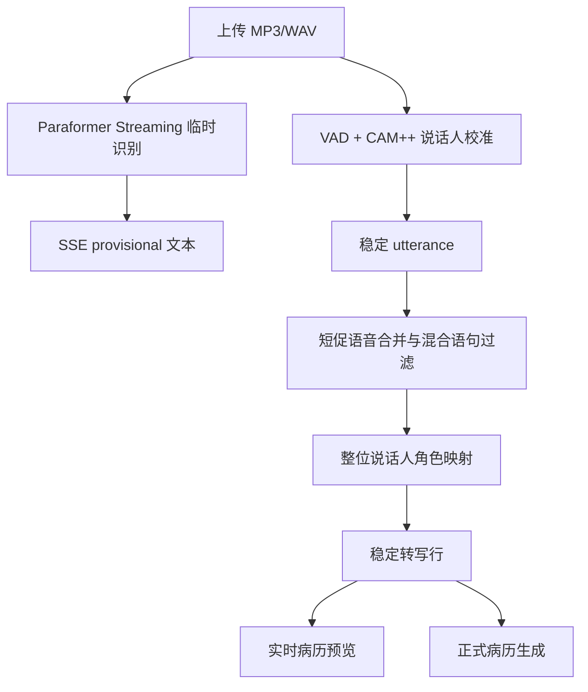

# 说话人分离与角色识别策略

本文说明 `v0.8.6-v0.8.9` 后医生端音频转写的角色识别路线。目标是减少“医生和患者句子混在一行”“所有人都被判成患者”“大量逐句待确认”等问题，同时不把不确定结果伪装成临床事实。

## 核心结论

- ASR 负责把音频转成文字，不等于知道谁在说话。
- Diarization 负责判断“什么时候由哪个声学说话人发言”。
- 临床角色识别负责把整位说话人映射为医生、患者或其他。
- 角色判断不再逐句做，而是按整位说话人的全部发言统一判断。
- 实时病历预览只消费稳定 utterance，不消费临时识别窗口。

## 当前处理流程

## v0.8.6 修复点

之前固定时间切段会把医生和患者放进同一段。例如医生问“您今年多少岁”，患者答“二十四岁”，如果刚好落在同一个切片里，前端只能给整段打一个角色标签。

`v0.8.6` 后：

- Paraformer Streaming 的窗口输出只作为 `provisional=true` 临时状态。
- 稳定列表只展示 VAD 或说话人边界确认后的 utterance。
- 重叠讲话标记为重叠语音，不强行写成医生或患者。
- SSE 事件改为追加式日志，断线后按 `Last-Event-ID` 恢复。

## v0.8.7 评测入口

当前支持三条评测路线：

| 引擎 | 作用 | 当前状态 |
| --- | --- | --- |
| FunASR CAM++ | 当前默认基线 | 可运行 |
| pyannote | 研究候选 | 依赖待安装 |
| 3D-Speaker | 研究候选 | 独立运行区待配置 |

评测指标包括 speaker count error、边界 F1、混合语句率、角色一致率、RTF、CPU 和 RSS。没有安装依赖时记录 `skipped`，不把缺环境写成模型效果差。

## v0.8.8 评测边界

已补 `fever_01` 和 `chest_pain_01` 两说话人人工 RTTM。三说话人样本仍为待补，不输出伪成绩。

当前两说话人汇总见：

- `data/asr_eval/reports/v0_8_8_diarization/diarization_summary.md`

## v0.8.9 角色识别策略

角色识别改为整位说话人级别：

1. 如果选择了医生声纹档案，先用 CAM++ embedding 锁定医生。
2. 如果剩余主要说话人只有一个，默认映射为患者。
3. 如果剩余多个说话人，可选用本地 Ollama `qwen3:4b-instruct` 根据整位说话人的全部发言判断患者或其他。
4. 如果模型不可用或置信度不足，只弹一次全局映射确认，例如“说话人 A=医生，B=患者，C=其他”。

这比逐句判断更稳定，因为短句“嗯、对、没有”本身没有足够角色信息。

## 为什么不能彻底去掉确认

可以减少逐句“待确认”，但不能把所有不确定性删除。以下情况必须保留一次全局确认：

- 单人朗读医患脚本，声学上只有一个真实说话人。
- 多人声音相似、重叠讲话或背景噪声较大。
- 有医生、患者、家属三类人，但声学模型只能给出 speaker A/B/C。
- 本地 LLM 不可用或输出不符合 JSON 结构。

当前前端不再逐句显示大量“待确认”，而是在需要时做一次全局映射确认。

## 前端测试方式

1. 打开 `http://127.0.0.1:2601/static/doctor.html`。
2. 上传 `fever_01.wav`，选择 `FunASR`。
3. 转写中应优先看到临时识别状态，校准后出现稳定转写行。
4. 如果识别出多个说话人，前端显示说话人 A/B，随后统一映射为医生/患者。
5. 点击“显示设置”或角色校正入口，修改一位说话人的角色，确认该说话人的全部发言同步更新。
6. 断开/刷新页面后恢复 session，已有 SSE 事件应继续显示，不应只剩前两段。

## 当前待补

- 三说话人真实课程样本与人工 RTTM。
- pyannote 和 3D-Speaker 同口径实测。
- 医院普通 Windows PC 实机复测。
- Ollama 本地模型真实可用性复测。
