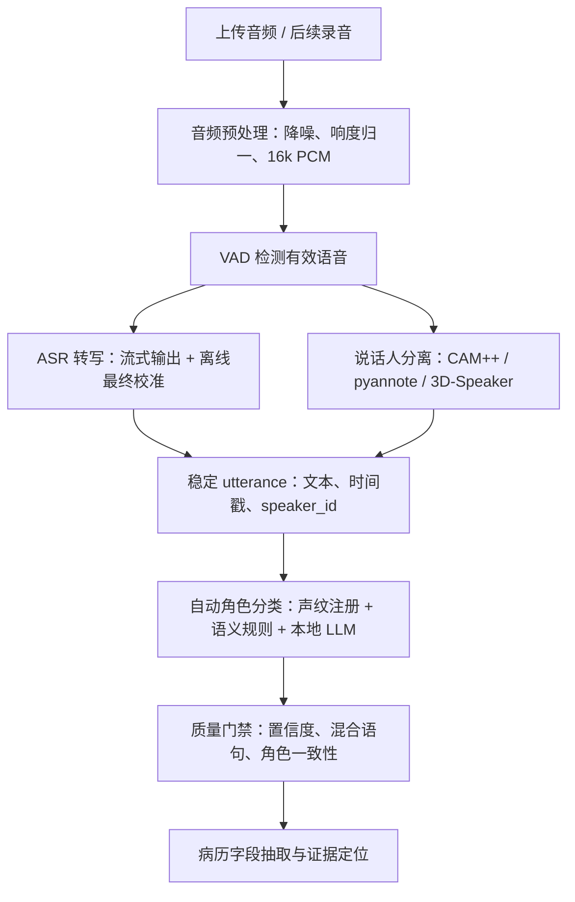

# v1.3.6 自动角色分类与转写准确率提升计划

## 当前目标

医生端不应要求医生逐句分类角色。系统应默认自动完成说话人识别和医生/患者/其他角色分类，并通过质量门禁保证“不确定时不误导”。医生只在最终审核或系统低置信度时看到一次性提示，不参与逐句分类。

## 本周迭代重点

本周重点不是边缘端部署，也不是继续扩大 UI，而是把系统从“工程原型能跑”推进到“自动化流程更稳定”：

1. 自动角色分类优先
   - 默认由程序完成说话人 A/B/C 聚类和医生/患者/其他角色判断。
   - 不再把“医生手动分类”作为主流程。
   - 低置信度不逐句打扰医生，而是进入后台质量门禁或一次性全局提示。

2. 转写文字准确率提升
   - 优先做音频预处理、医学热词、离线最终校准和标点恢复。
   - 用 CER、医学关键词召回率、首段返回时间、RTF、RSS 作为评估指标。

3. 角色准确率提升
   - 用说话人分离指标和角色指标共同评估，不只看文字转写。
   - 重点看 DER/JER、speaker 数量误差、混合语句率、角色准确率、自动分类率和人工兜底率。

4. 前端保持简洁
   - v1.3.3 保留 `录音生成` 接口。
   - `Mock 演示` 独立为评审保底入口。
   - 医生默认界面不展示模型、切片、门禁等工程细节。

## 自动分类技术路线

## 提升转写准确率的方法

| 方法 | 作用 | 当前优先级 |
| --- | --- | --- |
| 统一音频解码为 16kHz 单声道 PCM | 减少模型输入差异 | P0 |
| VAD 去除静音和噪声段 | 减少无效识别和乱分段 | P0 |
| 医学热词表 | 提高症状、检查、疾病、药品词召回 | P0 |
| 流式转写 + 离线最终校准 | 前端实时可见，最终文本更稳 | P0 |
| 标点恢复和句边界合并 | 减少短句、口头语、混合语句污染病历 | P0 |
| 多模型评测 FunASR/SenseVoice/Qwen/Whisper | 用数据决定默认模型 | P1 |
| 真实医患样本标注 | 为后续微调或模型选择提供数据 | P1 |

## 提升角色准确率的方法

| 方法 | 作用 | 当前优先级 |
| --- | --- | --- |
| 说话人分离后再做角色分类 | 避免一句里混入医生和患者 | P0 |
| 医生声纹注册 | 优先锁定医生 speaker | P0 |
| 整位 speaker 级角色判断 | 避免逐句猜测导致角色跳变 | P0 |
| 本地 LLM 语义兜底 | 根据上下文判断患者/家属/医生 | P1 |
| 全局角色映射质量门禁 | 低置信度不进入正式病历链路 | P1 |
| pyannote/3D-Speaker 对比 | 当 CAM++ 不够稳时替换或融合 | P1 |
| 医患+家属三说话人样本 | 覆盖真实陪诊场景 | P1 |

## 是否训练模型

当前不优先训练 ASR 大模型。训练需要足够多的授权医患音频、speaker turn、角色和病历字段标注，还需要独立测试集和算力。当前更务实的顺序是：

1. 收集和标注课程/模拟/公开样本。
2. 建立自动评测门禁。
3. 优化音频预处理、热词、分段、说话人分离和角色分类。
4. 若指标仍不达标，再考虑微调角色分类器、热词/后处理模块或特定 ASR 模型。

## 医生端行为

- 默认自动分类，不要求医生逐句分类。
- 医生看到的是“医生/患者/其他”或自动分类结果。
- 系统低置信度时，不把结果作为事实写入正式病历；只在审核前给出一次性提示。
- 后续录音生成接口保留，浏览器麦克风真正接入放到后续版本。

## 本周评审展示重点

1. 当前系统已经不是只做测试调试，而是在做产品化收敛。
2. 老师提出“模型选择医生不一定懂”，因此界面默认隐藏模型细节。
3. 老师提出“界面信息太多”，因此只保留关键结果，详细信息进详情。
4. 角色区分不会让医生逐句分类，系统会自动分类并用质量门禁兜底。
5. 录音生成接口保留，但本周演示优先用上传音频、粘贴文本和 Mock 演示。

## 参考依据

- [FunASR](https://github.com/modelscope/FunASR)：支持 ASR、VAD、标点、streaming 和 CAM++ speaker pipeline。
- [pyannote.audio](https://github.com/pyannote/pyannote-audio)：说话人分离、speaker change、overlap detection 候选。
- [3D-Speaker](https://github.com/modelscope/3D-Speaker)：说话人识别和 diarization 候选。
- [NVIDIA NeMo Sortformer](https://docs.nvidia.com/nemo-framework/user-guide/latest/nemotoolkit/asr/speaker_diarization/models.html)：高配 GPU/边缘端研究路线。
