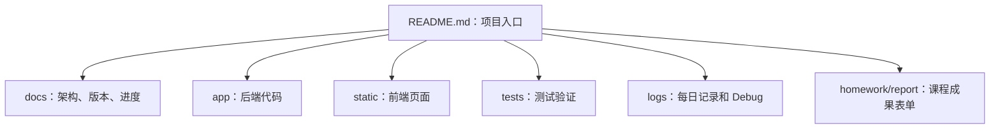
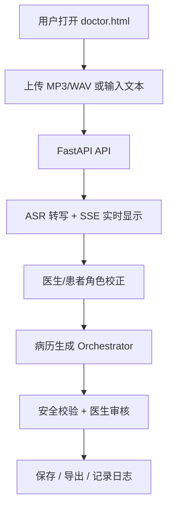

# Medical Record Agent 项目文件夹阅读指南

本文用于回答三个问题：这个项目有哪些文件夹、每个文件夹该看什么、不同目标下应该从哪里开始。

第一次看项目时，建议按这个顺序阅读：

1. 先看 [`README.md`](../README.md)：了解项目是什么、怎么运行、有哪些 API、怎么测试。
2. 再看本文件：了解每个文件夹的职责。
3. 想看进度，进入 [`版本演进记录.md`](版本演进记录.md)、[`四周迭代执行计划.md`](四周迭代执行计划.md)、[`能力证据追踪矩阵.md`](能力证据追踪矩阵.md)。
4. 想看每天做了什么，进入 [`logs/daily/`](../logs/daily/)。

## 项目总结构图



## 系统业务流程图



## 文件夹分类与阅读顺序

| 文件夹 | 类型 | 你应该看什么 | 用途 |
| --- | --- | --- | --- |
| `README.md` | 总入口 | 先看这个 | 项目简介、怎么运行、主要 API、测试方式 |
| `docs/` | 项目文档 | `版本演进记录.md`、`四周迭代执行计划.md`、`能力证据追踪矩阵.md`、`architecture.md` | 看项目进度、架构、能力证据 |
| `docs/scoring/` | 汇报评分材料 | `项目进度与评分证据看板.md`、`demo_script.md`、`demo_checklist.md` | 看汇报怎么讲、评分点怎么对应 |
| `docs/final_report/` | 最终报告材料 | 正式报告、截图清单、提交检查清单 | 写论文、报告、答辩材料时看 |
| `logs/daily/` | 每日记录 | 最新日期文件，例如 `2026-07-07.md` | 看每天完成了什么、遇到什么问题、怎么验证 |
| `logs/debug/` | Bug 调试记录 | 后续每个 Bug 一个文件 | 看问题、根因、修复、验证 |
| `homework/` | 成果手册表单 | `00_Medical_Record_Agent_学术成果表单填写汇总.docx` | 看已经填写好的课程成果表单 |
| `report/` | 原始手册与模板 | 成果手册源文件、附录模板 | 看学校手册、空白表单模板，不建议提交 GitHub |
| `versions/` | 版本归档 | 各版本 README | 看 `v0.1`、`v0.2`、`v0.3` 等阶段证据 |
| `app/` | 后端业务代码 | `api/`、`services/`、`agents/`、`schemas/` | 开发后端功能时看 |
| `static/` | 前端页面 | `doctor.html`、`doctor.js`、`debug.html` | 改网页交互和页面布局时看 |
| `tests/` | 测试 | 对应功能的 `test_*.py` | 验证功能是否正常 |
| `scripts/` | 工具脚本 | `update_homework_forms.py`、评测脚本、导出脚本 | 生成表单、评测、导出材料 |
| `data/` | 样例数据和输出 | `templates/`、`asr_eval/`、`annotation/` | 放样例、评测、知识库数据 |
| `.github/` | GitHub 工作流 | Issue 模板、PR 模板 | 创建任务和 PR 时看 |
| `config/` | 配置 | `hotwords_medical.txt` | 医学热词、配置类文件 |

## 按目标查文件

| 目标 | 先看 | 再看 | 验证方式 |
| --- | --- | --- | --- |
| 我想了解项目当前进度 | `docs/版本演进记录.md` | `docs/四周迭代执行计划.md`、`logs/daily/` | 对照 `docs/能力证据追踪矩阵.md` |
| 我想知道系统怎么运行 | `README.md` | `docs/architecture.md` | 运行 `python -m uvicorn app.main:app --reload --host 127.0.0.1 --port 8000` |
| 我想看网页功能 | `static/doctor.html` | `static/doctor.js`、`static/doctor.css` | 打开 `/static/doctor.html` 手动验收 |
| 我想看后端接口 | `app/api/` | `app/services/`、`app/schemas/` | 运行 `pytest -q tests/test_*api*.py` |
| 我想看 ASR 转写 | `app/api/asr_sessions.py` | `app/services/asr/`、`docs/asr_sse_file_stream.md` | 运行 `pytest -q tests/test_asr_sessions_api.py` |
| 我想看医生/患者角色校正 | `docs/asr_role_correction.md` | `app/services/asr/role_strategy.py`、`static/doctor.js` | 运行 `pytest -q tests/test_asr_role_strategy.py tests/test_asr_sessions_api.py` |
| 我想看报告和汇报材料 | `docs/final_report/` | `docs/scoring/` | 检查 `docs/final_report/报告提交检查清单.md` |
| 我想看成果手册表单 | `homework/` | `report/appendix_form_templates/` | 打开 Word 汇总表和单独表单 |
| 我想知道每天做了什么 | `logs/daily/` | `docs/dev_logs/` | 看最新日期日志和验证记录 |
| 我想新增功能 | `.github/ISSUE_TEMPLATE/feature.md` | `docs/四周迭代执行计划.md` | 创建 Issue 后开发并补测试 |
| 我想修 Bug | `.github/ISSUE_TEMPLATE/bug.md` | `logs/template.md`、`logs/debug/` | 记录复现、根因、修复、验证 |

## 当前版本进度

| 版本 | 状态 | 说明 |
| --- | --- | --- |
| `v0.1` | 已具备 | 基础 ASR、音频上传、ASRResult 和病历生成入口 |
| `v0.2` | 已具备 | 任务状态、步骤记录和 SSE 事件流 |
| `v0.2.1` | 已具备 | MP3/WAV ASR 会话级 SSE 文件流转写 |
| `v0.3` | 已具备 | 医生/患者角色分离、逐段校正和校正后病历生成 |
| `v0.4` | 基础已具备 | 字段抽取、病历草稿、安全校验和候选诊断 |
| `v0.4.1` | 已具备 | 知识库规则命中、候选诊断依据、建议检查、用药提示、风险提醒和建议补问 |
| `v0.4.2` | 已具备 | 规则来源说明、验证样例、验证报告和前端候选诊断解释展示 |
| `v0.5.0` | 已具备 | 本机硬件配置采集、mock ASR 基线、评测汇总报告和边缘端配置建议初稿 |
| `v0.5.1` | 已具备 | 本地 ASR 多引擎评测运行器，已记录 measured/skipped/failed 状态 |
| `v0.5.2` | 已具备第一轮 | FunASR/SenseVoice 已完成三条课程样本本机 CPU-only 实测；Whisper 缺 `ffmpeg`，Qwen3 依赖导入失败，均已记录阻塞原因 |
| `v0.5.3` | 已具备 | 公开非医疗音频 smoke 测试、便携 ffmpeg、Whisper 复测、Qwen-ASR 环境阻塞报告 |
| `v0.5.4` | 进行中 | 中文优先 ASR 评测口径、普通医院 Windows PC 配置基线、Python 3.12 Qwen-ASR 隔离环境复测 |
| `v1.0` | 待封版 | 前端产品化、稳定性测试、部署说明和最终交付 |

## 每次任务完成后的固定汇报格式

后续每完成一个任务，都按这个格式汇报：

```text
本次完成：
- 完成了什么。

修改文件：
- 文件 1：用途。
- 文件 2：用途。

怎么测试：
- 命令 1：结果。
- 命令 2：结果。

当前状态：
- 当前属于哪个版本阶段。
- 哪些已完成，哪些还没完成。

你应该看：
- 想了解功能，看哪个文件。
- 想验收，看哪个测试或日志。
```

## 维护规则

- 不为了整理文档而移动 `app/`、`static/`、`tests/`、`scripts/` 目录。
- 每次新增功能后，同步更新 `docs/能力证据追踪矩阵.md` 或对应 Issue。
- 每天更新 `logs/daily/YYYY-MM-DD.md`。
- 每个 Bug 都要在 `logs/debug/` 中留下调试报告。
- `report/` 和 `homework/` 是课程成果材料，是否提交 GitHub 需要单独确认。
